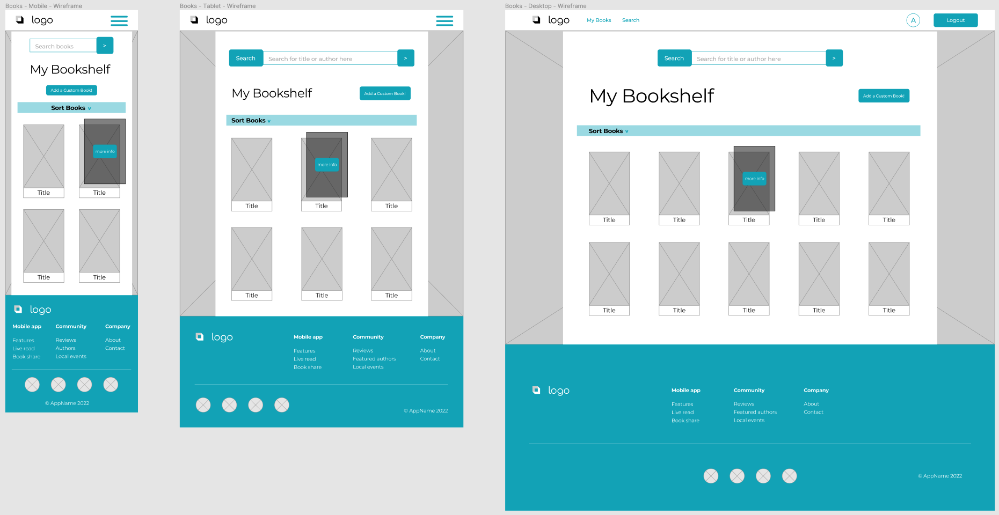

# .readME Book App: MERN Full-Stack App

**Week 11-12: April 2022. Final Capstone Project for General Assembly.**

.readMe book app: A full-stack MERN (React, Node/Express, MongoDB) web application to search and save books for vacation, fun, or anytime you need a reminder of what your next book should be!

## Deployed Website

Hosted via Heroku:\
https://readme-bookapp.herokuapp.com/


## Technology (MERN Stack)

- HTML | CSS | SASS | Javascript
- React
- Node | Express
- MongoDB | Mongoose


## Repositories

- Front-End (currently here):
    - https://github.com/angelafrancisco/bookapp-fe
- Back-End:
    - https://github.com/angelafrancisco/bookapp-be


## User Stories

- Homepage shows app features and links to login or register an account.
- User can create a new account and/or login.
- User can add books to their "My Bookshelf" section, adding:
    - Book title, author(s), description, image url, read status (read/ want to read/ currently reading), and adding book to a custom list.
- Once a book is added, it will show the cover image on the "My Bookshelf" section, and user can click to edit or delete a specific book.
- User can search for a book by title or author (via Google Books API) and see results.
- User can save a book from the search results along with including book status and custom book list, and it will show on the "My Bookshelf" section.


## Wireframing

Homepage


\
Login/Register


\
Bookshelf




## Capstone Project MVP Goals:

- A full-stack application (React + Node/Express/MongoDB)
- MVC file structure
- One model with full CRUD (book)
- Public API: [Google Books API](https://developers.google.com/books)
- Search functionality (using API data)
- Deployed online and accessible to the public via Heroku


## Capstone Project Stretch Goals:

- SASS
- Responsive Design
- React Router Links
- Saving API book results to "My Bookshelf"


## Future Features:

- Improved Accessibility
- Book recommendations (vacation reads, YA fantasy series, etc.)
- Organize books by custom list name
    - Show first 3-4 books, link to see full list on new page
- User model and authentication (currently created a temporary "login" React state)


## Model

``` 
const bookSchema = new Schema({
    title: { type: String }
    author: { type: String }
    description: { type: String }
    image: { type: String }
    read: read: { 
        type: String,
        enum: [
            "Read",
            "Want to Read",
            "Currently Reading"
        ]
    },
    listName: { type: String }
}, { timestamps: true })
```

## Run Locally

In the project directory, you can run:

`npm start`

Runs the app in the development mode.

Open [http://localhost:3000](http://localhost:3000) to view it in your browser.


## Credits/Acknowledgements

- Favicon and Logo: [Favicon.io](https://favicon.io/emoji-favicons/books/)
- Icons: [FontAwesome](https://fontawesome.com/icons), [Flaticon](https://www.flaticon.com/) via [Freepik](https://www.freepik.com) 
- Book Background: [Alfons Morales via Unsplash](https://unsplash.com/@alfonsmc10?utm_source=unsplash&utm_medium=referral&utm_content=creditCopyText)
